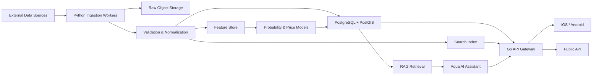

# AquaHunter

> Global Seafood Intelligence Platform  
> 面向全球海洋产业的价格、贸易、港口、船舶与海洋环境数据平台。

**产品定位：** Bloomberg for the Global Seafood Industry.

---

## 当前三端可运行基线

仓库当前包含 Android、iOS/iPadOS 和 macOS 三端原生客户端。Android 采用 Kotlin + Jetpack Compose；Apple 平台采用 SwiftUI 并共享产品核心。

### 当前实现

- Pulse：真实 SSB 03024 挪威养殖三文鱼周度出口基准摘要
- Markets：真实 NOK/kg 周度价格、出口重量、6W/30W/1Y 历史和来源许可
- Radar：鱼种切换与所需输入说明；数据源未完成产品级许可审计前不输出概率
- Network：买家、贸易、港口和船舶模块的许可状态；无合规数据时不展示记录
- Ask：只根据当前授权来源回答，证据不足时拒绝推断
- 地图：Google Maps 依赖已移除；MapLibre 仅在自托管或合规商业瓦片源就绪后启用
- 首次风险声明、设置、语言、主题与支持邮件
- 无账号、无广告、无分析 SDK、无敏感权限

当前唯一启用的生产数据源是 Statistics Norway Statbank 表 03024，按 CC BY 4.0 使用。其他来源必须按 [`DATA_SOURCE_POLICY.md`](DATA_SOURCE_POLICY.md) 和 [`data-sources.json`](data-sources.json) 完成商业使用、衍生、缓存、展示与再分发审查。

### 品牌图标与 UI 视觉基线

最终 App Icon 采用“蓝色雷达 + 蓝色狙击瞄准镜 + 绿色上涨趋势 + 三条鳕鱼群”的统一构图。UI 必须沿用同一视觉语言：深海蓝为背景，钴蓝与青色用于雷达、导航和主要交互，绿色只用于上涨、成功和高概率信号。


- 最终 1:1 商业母版：`artifacts/icon/aquahunter-app-icon-final.png`
- Android 自适应图标位图：`app/src/main/res/drawable-nodpi/aquahunter_app_icon_adaptive.png`
- Android 图标入口：`app/src/main/res/mipmap-anydpi/ic_launcher.xml`
- Android 单色主题图标：`app/src/main/res/drawable/ic_launcher_monochrome.xml`
- 视觉色板：深海蓝 `#041A38`、品牌蓝 `#168DFF`、雷达青 `#20C8FF`、上涨绿 `#31D17C`

### 本地运行

要求：

- Android Studio（含 JDK 21）
- Android SDK 36

当前不需要地图密钥。地图区域在合规 MapLibre 瓦片源接入前显示不可用；不得直接使用 OSM 社区标准瓦片作为生产后端。

```bash
JAVA_HOME="/Applications/Android Studio.app/Contents/jbr/Contents/Home" ./gradlew testDebugUnitTest assembleDebug
```

Debug APK：

```text
app/build/outputs/apk/debug/app-debug.apk
```

安装到已连接设备或模拟器：

```bash
adb install -r app/build/outputs/apk/debug/app-debug.apk
```

### Google Play AAB

生产上传前先确认永久包名 `com.hsaffiliate.aquahunter`，并在 Android developer verification 的 **Package names** 页面完成该包名注册；这是发布阻塞项。之后再创建并安全保存 upload key。复制 `keystore.properties.example` 为忽略提交的 `keystore.properties`，填写真实签名配置后执行：

```bash
JAVA_HOME="/Applications/Android Studio.app/Contents/jbr/Contents/Home" ./gradlew testDebugUnitTest lintDebug bundleRelease
```

Google Play 准备材料位于：

- `docs/google-play/PRIVACY_POLICY.md`
- `docs/google-play/DATA_SAFETY.md`
- `docs/google-play/STORE_LISTING.md`
- `docs/google-play/RELEASE_CHECKLIST.md`

---

## 1. 文档说明

本文档是 AquaHunter 的产品需求与开发基线，用于统一产品、设计、前端、后端、数据和 AI 团队的实现范围。

- 当前阶段：MVP 需求定义
- 产品名称：AquaHunter
- 工作名称：AquaHunter MVP
- 界面语言目标：12 种，数量和范围参考 Railingo；英语、简体中文、繁体中文、西班牙语、法语、德语、日语、韩语、巴西葡萄牙语、印尼语、印地语、阿拉伯语
- 默认时区：UTC；界面可切换为用户本地时区
- 默认货币：USD；支持原始货币与换算货币同时展示
- 数据原则：任何指标都必须显示来源、更新时间和可信度

测试 target/source set 可以使用不可发布的最小化测试夹具。任何可安装或可上传构建不得展示虚构业务记录，也不得在真实来源失败时静默回退。

---

## 2. 产品目标

AquaHunter 将分散在政府、市场、海洋遥感、贸易和 AIS 数据源中的信息标准化，为以下用户提供统一的搜索、地图、分析和 API：

- 渔民与船队运营方
- 海鲜贸易商、进口商与出口商
- 超市、餐饮与批发采购
- 冷链与物流企业
- 海鲜产业投资机构
- 科研机构

### 2.1 核心价值

用户可以通过 AquaHunter 回答四类问题：

1. **现在多少钱？** 查看不同市场、港口和品种的最新价格及历史趋势。
2. **谁在买、谁在卖？** 搜索采购商、进口商、供应商和公开商业联系方式。
3. **货与船在哪里？** 查看港口、贸易流向和授权范围内的船舶动态。
4. **哪里更可能有目标鱼种？** 基于海洋环境和历史数据输出概率，而不是确定性结论。

### 2.2 MVP 成功指标

MVP 上线后 90 天内重点观察：

| 指标 | 目标 |
| --- | ---: |
| 注册用户完成首次有效搜索 | ≥ 60% |
| 7 日留存率 | ≥ 20% |
| 价格详情页到达率 | ≥ 35% |
| 买家搜索产生的联系方式查看率 | ≥ 15% |
| AI Fish Radar 图层加载成功率 | ≥ 99% |
| API 月可用性 | ≥ 99.5% |
| 数据记录带来源与更新时间的比例 | 100% |

---

## 3. MVP 范围

### 3.1 P0：首个可发布版本

P0 必须形成一条完整用户路径：

> 选择海鲜品种 → 查看全球价格 → 进入市场详情 → 查看关联买家 → 使用 AI 获取摘要。

包含以下模块：

1. 全球海鲜价格
2. 品种行情详情
3. 全球买家数据库
4. 全球渔港
5. AI Fish Radar
6. 贸易流向
7. AI 问答
8. 用户、套餐与用量限制
9. 对外 REST API 基础版本
10. 数据来源、更新时间与免责声明

### 3.2 P1：MVP 后增强

- 全球渔船 AIS 实时或准实时地图
- 采购商地图
- 全球供应商数据库
- 数据导出 Excel/CSV
- 新闻聚合与情绪分析
- 收藏、监控列表与价格提醒
- Webhook

### 3.3 本期不做

- 在线询价、撮合交易、合同与 Escrow
- 支付结算
- 船队管理
- 冷链硬件接入
- 集装箱实时追踪
- 碳排放核算
- ERP、SAP、Oracle 深度集成
- “一定有鱼”或可被理解为捕捞保证的结论

---

## 4. 角色与权限

| 角色 | 主要权限 |
| --- | --- |
| Visitor | 查看有限价格、公开地图和新闻 |
| Free User | 搜索价格与买家，使用有限次数 AI 查询 |
| Pro User | 查看历史价格、AI 预测、完整公开联系方式、导出与 API |
| Enterprise User | 团队席位、更高 API 配额、Webhook 和企业集成 |
| Data Operator | 导入、清洗、审核和发布数据 |
| Admin | 用户、套餐、数据源、权限、审计与系统配置 |

敏感操作必须记录审计日志，包括数据发布、批量导出、API Key 创建、权限变更和管理员操作。

---

## 5. 信息架构

建议移动端页面：

```text
Overview
Prices
Price Detail
Buyers
Buyer Detail
Ports
Port Detail
Fish Radar
Trade Flows
Vessels
Suppliers
Supplier Detail
Ask Aqua
Watchlist
Account
API Keys
Plans
```

全局导航：

- Overview
- Prices
- Buyers
- Ports
- Fish Radar
- Trade Flows
- Ask Aqua

P1 导航：

- Vessels
- Suppliers
- Watchlist

---

## 6. 功能需求

## 6.1 全球海鲜价格

### 用户故事

作为采购商，我希望按品种、市场、国家、日期、规格和货币查看价格，以便比较采购成本。

### 页面

#### 价格总览 `/prices`

首批演示城市：

- Tokyo
- Oslo
- Seattle
- Sydney
- Shanghai
- Busan
- Taipei

页面包含：

- 世界地图与市场点位
- 品种搜索
- 国家/地区筛选
- 市场筛选
- 日期范围
- 规格、等级和形态筛选
- 价格排序
- 数据新鲜度筛选
- 表格/地图视图切换

每个市场卡片展示：

- 品种
- 市场
- 平均价
- 最高价
- 最低价
- 环比变化
- 样本量
- 计价单位
- 更新时间
- 数据来源

#### 品种行情 `/prices/:speciesSlug`

以 Bluefin Tuna 为例，展示：

- 今日平均价、最高价、最低价
- 近 7 天、30 天、1 年历史曲线
- 各市场价格对比
- 供应量与需求指数
- 数据覆盖率
- 相关新闻
- AI 行情摘要
- 未来 7 天上涨概率

### 价格标准化规则

价格数据必须保留原始值，并另外生成标准化值：

```text
原始价格 + 原始货币 + 原始单位
→ 汇率换算
→ 重量单位换算
→ 规格与等级映射
→ 标准化 USD/kg
```

不得把不同品种、规格、形态或等级的数据直接合并。缺失规格时必须标记 `unknown`，并降低可信度。

### 验收标准

- 用户可在 3 次交互内找到指定品种的全球市场价格。
- 每条价格均显示来源和更新时间。
- 用户切换货币后，图表、卡片和表格保持一致。
- 历史曲线不能将缺失日期错误显示为价格 0。
- 数据超过配置的新鲜度阈值时显示 `Stale`。
- Demo 数据必须有持续可见的 `Demo Data` 标记。

---

## 6.2 全球买家数据库

### 用户故事

作为出口商，我希望搜索特定海鲜品种的进口商与采购商，以便发现潜在客户。

### 搜索条件

- 关键词
- 品种：Salmon、Shrimp、Lobster、Crab、Sea Cucumber 等
- 国家/地区
- 买家类型
- 最近进口时间
- 进口次数区间
- 进口量区间
- 是否有公开联系方式

### 搜索结果

- Buyer
- Country
- Buyer Type
- Website
- Phone
- Email
- Products
- Import History Summary
- Last Active Date
- Data Source
- Verified Status

### 买家详情

- 企业基本资料
- 公开商业联系方式
- 采购品种
- 进口趋势
- 主要来源国
- 主要港口
- 关联供应商
- 数据来源与更新时间

### 合规要求

- 只展示合法获取的企业信息与公开商业联系方式。
- 联系方式必须记录来源 URL、抓取时间和可见性依据。
- 支持数据纠错、企业认领与删除请求。
- 不展示未经授权的个人联系方式。
- 第三方数据库必须在签署许可或确认再分发权后接入生产环境。

### 验收标准

- 支持按品种与国家组合搜索。
- 搜索结果支持分页、排序和空状态。
- 每条联系方式可追溯来源。
- Free 用户看到部分脱敏信息；Pro 用户按套餐规则解锁。
- 无有效授权的数据源不得出现在生产环境。

---

## 6.3 全球渔港

### 用户故事

作为贸易商，我希望查看主要港口的近期上岸量和价格，以判断区域供应变化。

### 首批港口

- Seattle
- Tokyo
- Busan
- Qingdao
- Rotterdam

### 港口详情

- 港口位置
- 今日/最近有效日期的 Landing Volume
- 价格概览
- Species
- Vessel Count
- 最近 7/30 天变化
- 数据来源
- 更新时间

当数据不是当天数据时，界面必须用实际日期替代 “Today”。

### 验收标准

- 地图和列表可互相定位。
- 港口无当天数据时显示最近有效数据日期，不允许伪造 0 值。
- 上岸量必须显示单位和统计口径。
- 船舶数量需标明时间窗口和数据来源。

---

## 6.4 全球渔船

全球渔船为 P1 功能；MVP 可展示受控演示数据验证交互。

### 船舶信息

- Vessel Name
- MMSI/IMO（授权允许时）
- Flag
- Vessel Type
- Current/Last Known Position
- Speed
- Course
- Last Port
- Last Signal Time
- Data Source

### 数据与安全

- 严格遵守 AIS 数据供应商的许可、延迟和再分发限制。
- 不得将过期位置描述为实时位置。
- UI 必须显示 `Live`、`Delayed` 或 `Last known`。
- 对可能涉及安全、隐私或监管限制的船舶信息进行降精度或隐藏。

---

## 6.5 AI Fish Radar

AI Fish Radar 不是声呐或鱼探仪，不声称探测到鱼群。它输出指定海域、时间和鱼种的**出现概率与环境适宜度**。

### 输入因子

- SST / Sea Surface Temperature
- Chlorophyll-a
- Ocean Current
- Bathymetry / Depth
- Moon Phase
- Season
- Historical Catch
- Weather
- Fishing Vessel Density（授权允许时）

### 页面 `/radar`

用户可设置：

- 目标鱼种
- 时间
- 海域
- 图层
- 概率阈值

地图热区：

- High Probability：红色
- Medium Probability：橙色
- Low Probability：蓝色
- No Data：灰色/透明

结果卡片示例：

```text
Bluefin Tuna
Probability: 78%
Confidence: Medium
Forecast window: Next 24 hours
Model version: tuna-v0.3
Updated: 2026-07-18 06:00 UTC
```

解释区必须列出：

- 主要正向因子
- 主要负向因子
- 数据缺口
- 模型版本
- 预测时间窗口
- 免责声明

### 概率表达要求

允许：

> 该区域在未来 24 小时内对 Bluefin Tuna 的环境适宜度较高，模型概率为 78%。

不允许：

> 这里一定有鱼。  
> 去这里一定能捕到金枪鱼。

### 验收标准

- 每个预测结果包含概率、置信度、时间窗口和模型版本。
- 无数据区域不能显示为低概率。
- 用户可查看预测的关键影响因子。
- 地图图例、单位和时间保持可见。
- 页面持续显示“概率预测，不代表捕捞保证”的免责声明。
- 模型离线评估、回测和校准结果达到发布门槛后才可移除 `Beta`。

---

## 6.6 全球行情

行情详情与价格详情共用 `/prices/:speciesSlug`。

### 主要指标

- 今日价格
- 7/30/365 天价格变化
- 供应量
- 需求指数
- 波动率
- 市场价差
- 新闻
- AI Summary
- 未来 7 天上涨概率

AI 分析必须区分：

- 已发生的事实
- 数据计算结果
- 模型预测
- 推测或不确定信息

预测示例：

```text
7-day upward probability: 67%
Confidence: Medium
Drivers: Tokyo supply -8%, buyer demand +12%
Model version: price-direction-v0.2
```

不得只显示单一百分比而不说明时间窗口、置信度和影响因素。

---

## 6.7 贸易流向

### 页面 `/trade-flows`

展示国家或地区之间的海鲜贸易关系，例如：

```text
Norway → China → USA → Japan
```

用户可按以下维度筛选：

- 品种
- HS Code
- 时间范围
- 出口国
- 进口国
- 运输方式

展示指标：

- Volume
- Value
- Container Estimate
- YoY Growth
- Average Unit Price
- Data Source

`Container Estimate` 必须明确为估算值，并说明计算方法。

### 验收标准

- 地图流向与表格汇总数值一致。
- 用户可从国家流向下钻到品种和时间维度。
- 所有统计显示 HS Code 口径和时间范围。
- 估算数据与官方统计数据必须视觉区分。

---

## 6.8 采购商地图

P1 功能，基于地图展示：

- Importer
- Wholesaler
- Restaurant
- Supermarket

联系方式：

- Phone
- Website
- Public Business Email
- WhatsApp Business（仅在合法公开且允许展示时）

地图不得默认展示精确个人住址；企业地址需经过地理编码和质量校验。

---

## 6.9 供应商数据库

P1 功能。以 `Vietnam + Shrimp` 为例，支持查询：

- Supplier Name
- Country
- Factory Location
- Products
- Export License
- Certificates
- Capacity
- Public Contact
- Last Verified Date

许可证和证书必须保存：

- 证书类型
- 发证机构
- 证书编号
- 生效日期
- 到期日期
- 验证链接或文件
- 验证状态

平台只展示验证状态，不替代用户的供应商尽调。

---

## 6.10 AI 问答

### 页面 `/ask`

示例：

```text
美国哪里买帝王蟹？
```

返回：

- 推荐市场或城市
- 匹配买家数量
- 平均采购价格或可用价格区间
- 可访问的公开联系人
- 使用的数据源
- 数据更新时间

示例：

```text
哪里的三文鱼最近价格最低？
```

返回：

- 市场/国家排名
- 标准化价格
- 规格与日期
- 汇率和单位说明
- 数据可信度

### 实现约束

- AI 只能基于平台可访问的数据回答事实问题。
- 使用检索增强生成（RAG），禁止让模型自行编造买家、价格或联系方式。
- 每个关键结论提供可点击的数据引用。
- 信息不足时返回“不足以判断”，并建议调整筛选条件。
- 对价格预测、鱼群概率和投资相关内容显示风险提示。
- 记录 Prompt 版本、模型、引用记录和反馈，不记录不必要的敏感信息。

### 验收标准

- 无数据时不生成虚构答案。
- 答案中的买家数量与搜索结果一致。
- 价格比较使用同一货币、重量单位、日期窗口和可比规格。
- 用户可跳转到引用的数据详情页。

---

## 6.11 Ocean Intelligence Score

Ocean Intelligence Score 是平台差异化指标，用于综合衡量“某鱼种、某海域、某时间窗口的捕捞与市场机会”，不等同于鱼群概率。

### 建议拆分

总分 0–100，由三个子分数组成：

1. **Environmental Suitability**：环境适宜度
2. **Operational Feasibility**：天气、距离、船舶密度等作业条件
3. **Market Opportunity**：价格、需求与供应变化

建议初版权重：

```text
Ocean Intelligence Score
= Environmental Suitability × 50%
+ Operational Feasibility × 20%
+ Market Opportunity × 30%
```

实际权重必须按鱼种与海域分别校准，不可把同一套权重直接用于所有场景。

### 输出

- 总分和子分数
- 排名前 20 的海域
- 适用鱼种
- 时间窗口
- 数据完整度
- 置信度
- 主要影响因子
- 模型版本

### 防误导要求

- 高市场机会不代表高鱼群概率。
- 高环境适宜度不代表合法、可进入或安全作业。
- 必须叠加禁渔区、海洋保护区、天气和法规提示。

---

## 7. 数据需求

## 7.1 候选数据源

以下均为候选来源，接入生产环境前必须完成 API 可用性、授权、地域限制、缓存、再分发和商业用途审查。权威许可结论以 [`DATA_SOURCE_POLICY.md`](DATA_SOURCE_POLICY.md) 和 [`data-sources.json`](data-sources.json) 为准；候选列表不代表获准使用。

| 数据域 | 候选来源 |
| --- | --- |
| 海鲜价格 | Toyosu、FAO、NOAA、各国市场与政府开放数据 |
| 贸易 | 各国海关与政府数据库、ImportYeti、Volza |
| 海洋环境 | NOAA、NASA、Copernicus Marine |
| 船舶与捕捞活动 | Global Fishing Watch、商业 AIS 数据源 |
| 港口 | 港口管理机构、渔业主管部门、开放港口数据 |
| 新闻 | 授权新闻 API、政府公告、行业公开信息 |

### 数据源上线清单

每个数据源必须记录：

- Source ID 与名称
- 官方链接
- Owner
- License
- Commercial Use
- Redistribution Rights
- Attribution Requirement
- Rate Limit
- Geographic Coverage
- Update Frequency
- Retention Rule
- Quality Score
- Last Successful Sync
- Incident Contact

## 7.2 数据质量

数据质量评分建议由以下维度组成：

- Freshness
- Completeness
- Consistency
- Source Reliability
- Sample Size
- Geospatial Accuracy

每条标准化记录必须保留：

- 原始数据引用
- 采集时间
- 原始更新时间
- 标准化版本
- 数据源
- 转换日志
- 质量评分

## 7.3 数据刷新建议

| 数据类型 | 目标刷新频率 |
| --- | --- |
| 市场价格 | 1 小时至 1 天，取决于来源 |
| 港口上岸量 | 每日 |
| 海洋环境栅格 | 3–24 小时 |
| 贸易统计 | 每月 |
| 买家/供应商资料 | 每月或按来源 |
| AIS | 按许可支持实时、延迟或定时快照 |
| 新闻 | 15–60 分钟 |

刷新频率是产品目标，最终以数据源许可和真实发布频率为准。

---

## 8. 核心数据模型

建议使用 PostgreSQL + PostGIS。以下字段为逻辑模型，开发时通过 migration 固化。

### 8.1 Species

| 字段 | 类型 | 说明 |
| --- | --- | --- |
| id | UUID | 主键 |
| common_name | TEXT | 常用名 |
| scientific_name | TEXT | 学名 |
| slug | TEXT UNIQUE | URL 标识 |
| fao_code | TEXT NULL | FAO 代码 |
| hs_codes | TEXT[] | 关联 HS Code |
| aliases | JSONB | 多语言别名 |
| status | ENUM | active/inactive |

### 8.2 Market

| 字段 | 类型 | 说明 |
| --- | --- | --- |
| id | UUID | 主键 |
| name | TEXT | 市场名称 |
| city | TEXT | 城市 |
| country_code | CHAR(2) | ISO 国家代码 |
| location | GEOGRAPHY(POINT) | 经纬度 |
| timezone | TEXT | IANA 时区 |
| source_id | UUID | 数据源 |

### 8.3 PriceObservation

| 字段 | 类型 | 说明 |
| --- | --- | --- |
| id | UUID | 主键 |
| species_id | UUID | 品种 |
| market_id | UUID | 市场 |
| observed_at | TIMESTAMPTZ | 价格时间 |
| price_low | NUMERIC | 最低价 |
| price_avg | NUMERIC | 平均价 |
| price_high | NUMERIC | 最高价 |
| currency | CHAR(3) | 原始货币 |
| unit | TEXT | 原始单位 |
| normalized_usd_kg | NUMERIC NULL | 标准化价格 |
| grade | TEXT NULL | 等级 |
| form | TEXT NULL | 鲜活/冷冻/整鱼等 |
| sample_size | INTEGER NULL | 样本量 |
| source_id | UUID | 数据源 |
| source_record_id | TEXT | 原始记录标识 |
| quality_score | NUMERIC | 0–1 |
| ingested_at | TIMESTAMPTZ | 入库时间 |

### 8.4 Organization

买家与供应商统一建模。

| 字段 | 类型 | 说明 |
| --- | --- | --- |
| id | UUID | 主键 |
| name | TEXT | 企业名称 |
| type | ENUM | buyer/supplier/both |
| country_code | CHAR(2) | 国家 |
| address | TEXT NULL | 企业地址 |
| location | GEOGRAPHY(POINT) NULL | 地理位置 |
| website | TEXT NULL | 官网 |
| public_phone | TEXT NULL | 公开商业电话 |
| public_email | TEXT NULL | 公开商业邮箱 |
| products | JSONB | 关联品种与产品 |
| verification_status | ENUM | unverified/verified/stale/disputed |
| last_verified_at | TIMESTAMPTZ NULL | 最近验证 |
| source_id | UUID | 数据源 |

### 8.5 TradeRecord

| 字段 | 类型 | 说明 |
| --- | --- | --- |
| id | UUID | 主键 |
| period | DATE | 统计周期 |
| exporter_country | CHAR(2) | 出口国 |
| importer_country | CHAR(2) | 进口国 |
| hs_code | TEXT | HS Code |
| species_id | UUID NULL | 映射品种 |
| volume_kg | NUMERIC NULL | 数量 |
| value_usd | NUMERIC NULL | 金额 |
| container_estimate | NUMERIC NULL | 估算箱量 |
| source_id | UUID | 数据源 |
| quality_score | NUMERIC | 质量分 |

### 8.6 PortLanding

| 字段 | 类型 | 说明 |
| --- | --- | --- |
| id | UUID | 主键 |
| port_id | UUID | 港口 |
| species_id | UUID | 品种 |
| landing_date | DATE | 上岸日期 |
| volume_kg | NUMERIC NULL | 上岸量 |
| vessel_count | INTEGER NULL | 船舶数 |
| avg_price_usd_kg | NUMERIC NULL | 平均价 |
| source_id | UUID | 数据源 |

### 8.7 VesselPosition

大规模 AIS 轨迹建议存储在分区时序表或专用分析存储中。

| 字段 | 类型 | 说明 |
| --- | --- | --- |
| vessel_id | UUID | 船舶 |
| recorded_at | TIMESTAMPTZ | 信号时间 |
| location | GEOGRAPHY(POINT) | 位置 |
| speed_knots | NUMERIC NULL | 航速 |
| course | NUMERIC NULL | 航向 |
| source_id | UUID | 数据源 |
| visibility | ENUM | live/delayed/last_known/restricted |

### 8.8 FishProbability

| 字段 | 类型 | 说明 |
| --- | --- | --- |
| id | UUID | 主键 |
| species_id | UUID | 目标品种 |
| cell_id | TEXT | 栅格或 H3 Cell |
| valid_from | TIMESTAMPTZ | 起始时间 |
| valid_to | TIMESTAMPTZ | 结束时间 |
| probability | NUMERIC | 0–1 |
| confidence | ENUM | low/medium/high |
| factors | JSONB | 影响因子 |
| data_completeness | NUMERIC | 0–1 |
| model_version | TEXT | 模型版本 |
| generated_at | TIMESTAMPTZ | 生成时间 |

---

## 9. API 需求

API 基础路径：

```text
/api/v1
```

### 9.1 首批接口

```http
GET /api/v1/prices
GET /api/v1/prices/history
GET /api/v1/buyers
GET /api/v1/suppliers
GET /api/v1/ports
GET /api/v1/vessels
GET /api/v1/fish-probability
GET /api/v1/trade-flows
GET /api/v1/weather
GET /api/v1/news
POST /api/v1/ask
```

### 9.2 通用规则

- JSON 使用 `camelCase`
- 时间使用 ISO 8601 UTC
- 国家使用 ISO 3166-1 alpha-2
- 货币使用 ISO 4217
- 重量标准单位使用 `kg`
- 距离使用 `km`，航速使用 `knots`
- 分页使用 cursor
- 所有响应返回 `requestId`
- 所有数据记录返回 `source` 与 `updatedAt`
- API Key 只在创建时完整显示一次

### 9.3 响应封装

```json
{
  "data": [],
  "meta": {
    "requestId": "req_01...",
    "nextCursor": null,
    "dataFreshness": "2026-07-18T06:00:00Z"
  },
  "errors": []
}
```

### 9.4 价格查询示例

```http
GET /api/v1/prices?species=bluefin-tuna&market=tokyo&currency=USD&unit=kg
```

```json
{
  "data": [
    {
      "species": {
        "slug": "bluefin-tuna",
        "commonName": "Bluefin Tuna"
      },
      "market": {
        "name": "Toyosu Market",
        "city": "Tokyo",
        "countryCode": "JP"
      },
      "observedAt": "2026-07-18T00:00:00Z",
      "price": {
        "low": 34.2,
        "average": 41.8,
        "high": 56.5,
        "currency": "USD",
        "unit": "kg"
      },
      "grade": "A",
      "form": "fresh-whole",
      "qualityScore": 0.91,
      "source": {
        "name": "Demo Source",
        "url": null
      },
      "updatedAt": "2026-07-18T06:00:00Z",
      "demo": true
    }
  ],
  "meta": {
    "requestId": "req_01J...",
    "nextCursor": null,
    "dataFreshness": "2026-07-18T06:00:00Z"
  },
  "errors": []
}
```

### 9.5 Fish Probability 示例

```http
GET /api/v1/fish-probability?species=bluefin-tuna&bbox=140,30,150,40&at=2026-07-19T00:00:00Z
```

返回 GeoJSON：

```json
{
  "data": {
    "type": "FeatureCollection",
    "features": [
      {
        "type": "Feature",
        "geometry": {
          "type": "Polygon",
          "coordinates": []
        },
        "properties": {
          "species": "bluefin-tuna",
          "probability": 0.78,
          "confidence": "medium",
          "validFrom": "2026-07-19T00:00:00Z",
          "validTo": "2026-07-20T00:00:00Z",
          "modelVersion": "tuna-v0.3",
          "dataCompleteness": 0.86
        }
      }
    ]
  },
  "meta": {
    "requestId": "req_01J...",
    "dataFreshness": "2026-07-18T06:00:00Z"
  },
  "errors": []
}
```

### 9.6 错误码

| HTTP | Code | 含义 |
| ---: | --- | --- |
| 400 | INVALID_ARGUMENT | 参数不合法 |
| 401 | UNAUTHENTICATED | 未认证 |
| 403 | PLAN_LIMIT_REACHED | 套餐限制 |
| 404 | NOT_FOUND | 资源不存在 |
| 409 | CONFLICT | 资源冲突 |
| 422 | INCOMPARABLE_DATA | 数据不可直接比较 |
| 429 | RATE_LIMITED | 请求过多 |
| 503 | DATA_SOURCE_UNAVAILABLE | 上游数据不可用 |

---

## 10. 技术架构

### 10.1 推荐技术栈

前端：

- iOS：SwiftUI
- Android：Jetpack Compose
- Android 地图：Google Maps SDK for Android（原生基础地图 SKU）
- iOS 地图：Apple MapKit
- 3D 海洋：Cesium（P2，可选）

后端：

- Go：高并发公共 API、认证、权限与业务服务
- Python：数据采集、标准化、地理计算、模型训练与推理
- PostgreSQL + PostGIS：业务与地理数据
- Redis：缓存、限流与任务状态
- Elasticsearch/OpenSearch：企业、品种与全文搜索
- 对象存储：原始文件、栅格、模型产物和导出文件

AI：

- LLM Provider Adapter：支持 OpenAI、Claude 或本地模型
- RAG：只使用已授权并完成索引的平台数据
- Model Registry：记录模型版本、指标、训练数据窗口和发布时间

### 10.2 逻辑架构



### 10.3 服务边界

MVP 可采用模块化单体，避免过早拆分微服务：

- Identity & Billing
- Catalog
- Prices
- Organizations
- Ports
- Trade
- Ocean Data
- AI & Forecast
- Data Ingestion
- Admin

当数据量、部署节奏或团队边界形成独立需求后再拆分服务。

---

## 11. 前端要求

### 11.1 设计原则

- 专业、可信、数据密集，但不拥挤。
- 地图是核心工作区，不是装饰背景。
- 颜色不能作为唯一状态表达方式。
- 所有预测同时显示概率、置信度、时间窗口和数据新鲜度。
- 真实数据、估算数据、预测数据和 Demo 数据有明确视觉差异。

### 11.2 响应式

- Desktop：1440px 优先，支持 1280px
- Tablet：768px 以上可完整使用
- Mobile：优先支持搜索、详情、收藏和 AI 问答；复杂地图可简化

### 11.3 国际化

- 文案不得硬编码在组件中。
- 数字、日期、货币和单位按 locale 格式化。
- 品种同时保存常用名、学名和多语言别名。
- 支持从左到右布局；RTL 作为后续范围。

### 11.4 无障碍

- 目标 WCAG 2.1 AA。
- 地图关键数据必须有等价列表或表格。
- 支持键盘导航、可见焦点和屏幕阅读器标签。
- 图表提供文本摘要和可下载数据。

---

## 12. 非功能需求

### 12.1 性能

| 场景 | 目标 |
| --- | ---: |
| 核心页面 LCP（p75） | < 2.5s |
| 常规 API 响应（p95） | < 500ms |
| 搜索 API（p95） | < 1s |
| 地图首屏可交互 | < 3s |
| AI 首个流式响应 | < 3s |

大体量 GeoJSON 不直接整包返回，应使用矢量瓦片、栅格瓦片或按视口聚合。

### 12.2 可用性

- MVP 月可用性目标：99.5%
- 上游数据源异常不能导致整个站点不可用。
- 展示最近一次成功数据，并标记过期状态。
- 关键数据任务支持重试、幂等和死信队列。

### 12.3 安全

- 全站 HTTPS
- 密码使用成熟身份服务或强哈希算法
- API Key 加密存储并支持轮换
- RBAC 与服务端权限校验
- 管理后台启用 MFA
- 导出与联系人查看限流
- 输入验证、SQL 注入、XSS、SSRF 和 Prompt Injection 防护
- 密钥只通过 Secret Manager/环境变量管理

### 12.4 隐私与合规

- 建立隐私政策、服务条款、数据纠错和删除流程。
- 对联系方式、位置与行为数据进行最小化收集。
- 明确不同司法辖区的数据处理与跨境传输要求。
- 对捕捞建议显示安全、法规和环境责任提示。
- 生产接入前由专业人员完成数据许可与法律审查。

### 12.5 可观测性

- 结构化日志
- Metrics 与分布式追踪
- 数据管道成功率和延迟
- API 错误率与延迟
- 模型预测分布、漂移和校准
- AI 引用命中率与无答案率
- 告警分级和 Runbook

---

## 13. 套餐与计费

### Free

- 最新价格
- 基础地图
- 新闻
- 有限搜索
- 有限 AI 查询

### Pro

- AI 预测
- 按许可开放完整公开商业联系方式
- 历史价格
- API
- Excel/CSV 导出
- 收藏和提醒

### Enterprise

- 高配额 API
- Webhook
- 团队权限
- SLA
- 企业数据集成
- ERP、SAP、Oracle 对接（后续）

套餐限制必须在服务端执行，前端隐藏按钮不能作为权限控制。

---

## 14. 建议仓库结构

```text
aquahunter/
├── app/                     # Android Kotlin + Jetpack Compose
├── ios/                     # SwiftUI（iOS 阶段创建）
├── services/
│   ├── api/                 # Go API
│   └── worker/              # Python ingestion / AI
├── packages/
│   ├── contracts/           # OpenAPI / JSON Schema
│   └── config/              # Shared config
├── db/
│   ├── migrations/
│   └── seeds/
├── data/
│   ├── fixtures/            # Demo data
│   └── schemas/
├── docs/
│   ├── adr/                 # Architecture decisions
│   ├── data-sources/
│   └── runbooks/
├── infra/
├── .env.example
├── docker-compose.yml
└── README.md
```

---

## 15. 开发环境目标

项目脚手架完成后，应支持：

```bash
cp .env.example .env
docker compose up -d
make db-migrate
make seed
make dev
```

本地自动化测试可以使用仅存在于测试 target/source set 的 fixture。可安装的 Debug 与 Release 应用不得静默展示虚构业务数据；未连接合规数据源时必须显示不可用或空状态。

移动端统一采用 MapLibre 渲染。底图只使用自托管、版本固定且满足 ODbL 义务的 OSM 衍生瓦片，或另有明确商业移动应用授权的供应商。不得直接依赖 OSM 社区标准瓦片；Google/Apple 地图不属于当前免费开放方案。

建议环境变量：

```dotenv
APP_ENV=development
DATABASE_URL=
REDIS_URL=
SEARCH_URL=
OBJECT_STORAGE_ENDPOINT=
OBJECT_STORAGE_BUCKET=
MAP_STYLE_URL=
OPENAI_API_KEY=
AI_PROVIDER=openai
DATA_MODE=unavailable
```

`.env.example` 只放变量名和安全示例，不提交真实密钥。

---

## 16. 测试策略

### 单元测试

- 单位与汇率转换
- 价格可比性判断
- 权限和套餐限制
- 数据质量评分
- 概率与指数计算

### 集成测试

- 数据导入 → 标准化 → API 查询
- 搜索索引同步
- API 鉴权与限流
- AI 检索与引用
- 上游异常和重试

### 端到端测试

1. 搜索 Bluefin Tuna。
2. 比较 Tokyo 与 Seattle 的标准化价格。
3. 打开历史曲线并切换货币。
4. 搜索关联买家。
5. 向 Aqua AI 询问最低价格市场。
6. 验证答案引用到同一批数据。

### 模型验证

- 时间切分回测，避免未来数据泄露
- 按鱼种和海域分别评估
- Probability calibration
- Precision/Recall 或适合业务目标的指标
- 数据漂移监控
- 与简单基线模型比较
- 专家审核与用户反馈闭环

---

## 17. 发布计划

### Phase 0：产品与数据验证（2–3 周）

- 确认 3 个优先品种
- 确认 5–7 个优先市场
- 完成候选数据源授权审查
- 建立 Demo 数据字典
- 完成页面原型和 API Contract

退出条件：

- 至少一个价格源具备可用样本
- 至少一个海洋环境数据管道跑通
- 数据许可风险有明确结论

### Phase 1：基础平台（3–4 周）

- Android 基础框架与 Google Maps 原生基础地图
- 用户与套餐
- Species、Market、Price 模型
- 数据导入、标准化和后台审核
- 价格总览与详情

退出条件：

- 价格核心链路端到端可用
- 100% 价格记录可追溯来源

### Phase 2：买家、港口与贸易（3–4 周）

- 买家搜索与详情
- 港口地图与详情
- 贸易流向
- 联系方式权限和审计

退出条件：

- 搜索、分页、筛选和权限通过测试
- 联系方式数据完成合规检查

### Phase 3：AI 与 Fish Radar Beta（4–6 周）

- 海洋数据栅格管道
- Fish Probability 基线模型
- 模型解释与免责声明
- RAG 问答与引用
- Ocean Intelligence Score 实验版

退出条件：

- 完成回测与概率校准报告
- AI 无数据场景不生成事实
- 所有预测显示模型版本和置信度

### Phase 4：上线准备（2 周）

- 性能、安全与可用性测试
- 监控、告警和 Runbook
- 隐私政策、服务条款与数据纠错流程
- 在 Android developer verification 注册最终包名 `com.hsaffiliate.aquahunter`
- 生产数据审核
- 灰度发布

---

## 18. MVP Definition of Done

MVP 只有在以下条件全部满足时才算完成：

- [ ] 用户可搜索品种并比较至少 5 个市场的价格
- [ ] 价格支持历史趋势、货币切换和单位标准化
- [ ] 每条数据均有来源、更新时间和质量状态
- [ ] 买家支持按品种和国家搜索
- [ ] 港口支持地图和详情联动
- [ ] 贸易流向支持品种、国家和时间筛选
- [ ] Fish Radar 输出概率、置信度、时间窗口和解释因子
- [ ] AI 问答提供可点击引用且无数据时不编造
- [ ] Free/Pro/Enterprise 权限在服务端生效
- [ ] 发行包不包含虚构业务数据；无合规数据时显示不可用
- [ ] `python3 tools/validate_data_sources.py --release` 通过
- [ ] API 有版本、鉴权、限流、分页和错误码
- [ ] 核心流程有自动化测试
- [ ] 数据许可、隐私和免责声明通过上线审查
- [ ] Android developer verification 已注册最终包名 `com.hsaffiliate.aquahunter`，开发者身份状态有效
- [ ] 12 种界面语言完成全量文案、布局、格式化和回退测试，阿拉伯语完成 RTL 验收
- [ ] 监控、告警、备份和故障手册可用

---

## 19. 首批开发 Backlog

### Epic A：基础工程

- [ ] 初始化 monorepo
- [ ] 建立本地 Docker 开发环境
- [ ] 配置 CI
- [ ] 建立数据库 migration
- [ ] 建立 OpenAPI Contract
- [ ] 建立 Demo Seed
- [ ] 建立 Android/iOS 字符串资源、12 语言目录和翻译完整性检查
- [ ] 验证简繁中文、阿拉伯语 RTL、长德语文案及区域化日期/货币格式

### Epic B：价格

- [ ] Species 与 Market 管理
- [ ] PriceObservation 导入
- [ ] 单位与汇率标准化
- [ ] 价格搜索 API
- [ ] 历史价格 API
- [ ] 价格地图
- [ ] 价格详情与趋势图

### Epic C：企业与港口

- [ ] Organization 数据模型
- [ ] 买家搜索与详情
- [ ] 联系方式权限与审计
- [ ] Port 与 PortLanding
- [ ] 港口地图与详情

### Epic D：贸易

- [ ] HS Code 映射
- [ ] TradeRecord 导入
- [ ] 贸易聚合 API
- [ ] 贸易流向地图

### Epic E：AI

- [ ] 海洋环境数据管道
- [ ] FishProbability 存储与瓦片服务
- [ ] 基线概率模型
- [ ] 模型注册与版本管理
- [ ] RAG 检索
- [ ] AI 问答引用
- [ ] Ocean Intelligence Score 实验

### Epic F：商业化与运营

- [ ] 套餐与配额
- [ ] API Key 管理
- [ ] Admin 数据审核
- [ ] 数据纠错与删除请求
- [ ] 用量和转化分析

---

## 20. 待确认问题

开发启动前需要产品负责人优先确认：

1. 首批 3 个重点品种是什么？
2. 首批目标市场和国家的优先级是什么？
3. Android 首发后，iOS 的目标发布日期是什么？
4. 哪些数据源已经获得商业使用与再分发授权？
5. 买家数据库首批覆盖哪些国家？
6. Free 与 Pro 的具体额度和价格是多少？
7. Fish Radar 首批支持哪些鱼种和海域？
8. 产品是否允许向用户展示精确船舶位置？
9. Ocean Intelligence Score 更偏捕捞机会还是采购/交易机会？
10. MVP 的真实数据覆盖率上线门槛是多少？

在以上问题确认前，开发可使用以下默认假设推进：

- Android 优先，iOS 随后；不开发 Web 客户端
- Bluefin Tuna、Salmon、Shrimp 为首批品种
- Tokyo、Oslo、Seattle、Sydney、Shanghai、Busan、Taipei 为首批市场
- 所有外部数据默认视为“未授权用于商业再分发”，直至完成审查
- AIS 仅做 Demo，不在 P0 发布真实实时位置
- Fish Radar 以 Bluefin Tuna + 西北太平洋作为首个模型验证场景

---

## 21. 后续路线

### V2

- AI 采购助手
- AI 出口助手
- AI 报价
- 价格与供应监控
- Webhook

### V3

- 全球海鲜交易市场
- 在线询价（RFQ）
- 在线合同
- Escrow

### V4

- 船队管理
- 冷链监控
- 集装箱追踪
- 碳排放统计

### SDK

API 稳定后按使用量优先开发：

- Python
- Node.js
- Swift
- Kotlin
- Flutter/Dart

---

## 22. 产品原则

1. **来源优先：** 没有来源的数据不进入生产展示。
2. **概率不是事实：** 预测必须带时间窗口、置信度和解释。
3. **可比后再比较：** 不同规格、单位、时间和品质的数据不能直接排名。
4. **新鲜度可见：** 用户始终知道数据是什么时候更新的。
5. **合规先于覆盖：** 不以数据量为理由绕过许可、隐私或安全限制。
6. **地图之外有替代：** 所有关键地图信息都应提供列表、表格或 API。
7. **先验证单一闭环：** 先把“品种 → 价格 → 买家 → AI 摘要”做完整，再扩展功能数量。
